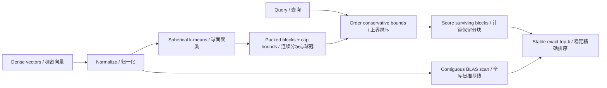

# CapPrune

**Exact cosine search with auditable spherical-cap block pruning.**

[简体中文](README_zh.md) · [GitHub](https://github.com/hardwork-xu/capprune) · [CI runs](https://github.com/hardwork-xu/capprune/actions)

[](https://github.com/hardwork-xu/capprune/actions/workflows/ci.yml)


## Why this project

I built CapPrune to study a concrete retrieval bottleneck: repeatedly scoring every vector when only a few similar results are needed. I want to make the tradeoff inspectable, including inputs where geometric pruning loses to optimized dense computation. The intended users are engineers studying exact vector retrieval, maintainers of local immutable vector collections, and researchers who need a correctness reference for approximate search.

The contribution is a complete CPU implementation of block construction, conservative angular bounds, tie-safe partial top-k, persistence validation and reproducible experiments. Spherical k-means and angular branch-and-bound are established methods, not new algorithms invented here. NumPy supplies matrix operations; this repository implements search orchestration and its invariants. See the [primary-source comparison](docs/en/RESEARCH.md).

## Scope and status

Validated locally on macOS 26.6.2 arm64, Apple M1 Pro, 16 GiB, Python 3.12.2, NumPy 2.2.6 / Accelerate: all three search paths (`scan`, `blocked`, `pruned`), API, bilingual CLI, offline demo, atomic save/reload, 70 tests and package installation. [GitHub Actions on Ubuntu 24.04](https://github.com/hardwork-xu/capprune/actions/runs/35602650743) also passed the same 70-test suite, static/type checks, package build, benchmark smoke, plot generation, and Docker build/run. Python 3.12 is the declared version range. Full performance measurements remain macOS-only; CI smoke is not a Linux performance claim. See [publication evidence](results/publication.json). No GPU backend, online updates, sparse vectors, embedding model or service is provided.

The algorithm is exact in real arithmetic; guarded float64 output is checked against the scan baseline. This is not a formal interval-arithmetic certification for every adversarial input or BLAS implementation. Equal computed scores use ascending original row ID.

## Architecture and mechanism



For normalized query `q`, unit block center `c`, `a=q·c`, and conservative cap minimum `s≤min(x·c)`, the score bound is `U=1` when `a≥s`; otherwise `U=a*s+sqrt(1-a²)*sqrt(1-s²)`. Blocks are visited by decreasing bound. Pruning occurs only when a guarded bound is strictly below the current kth score. Actual scores determine every returned item. The [proof and numerical contract](docs/en/RESEARCH.md) explain outward rounding and limitations.

The index deliberately keeps original and packed float64 layouts: vector payload alone costs `16*N*d` bytes. Assignment score matrices respect a configured scratch budget; total process memory is not capped. The worst case still scans all vectors. `blocked` disables pruning while retaining block layout to isolate the mechanism.

## Install and quick start

Clone the public repository, then run from its root with Python 3.12. The bootstrap and project environments are local; no global package installation is required. An initial dependency download is required; default tests and demos subsequently work offline.

```sh
git clone https://github.com/hardwork-xu/capprune.git
cd capprune
python3.12 -m venv .bootstrap
.bootstrap/bin/python -m pip install uv==0.8.22
.bootstrap/bin/uv sync --frozen
make demo
make check
make build
```

If `uv==0.8.22` is already available, `uv sync --frozen` replaces the three bootstrap commands. [The lockfile](uv.lock) fixes complete package versions and hashes. `make build` produces a wheel and source distribution under `dist/`.

```python
import numpy as np
from capprune import CapIndex

vectors = np.array([[1., 0.], [0., 1.], [1., 1.]])
index = CapIndex.build(vectors, n_clusters=2)
result = index.search([1., 0.], k=2)
assert result.ids.tolist() == [[0, 2]]
index.save("index.npz")
assert CapIndex.load("index.npz").search([1., 0.], k=2).ids.tolist() == [[0, 2]]
```

The CLI accepts your own finite nonzero dense `.npy` arrays; rows are vectors. The following file commands expect `vectors.npy` and `queries.npy` to exist. The first command is a standalone synthetic demonstration requiring no files or model downloads.

```sh
.venv/bin/python examples/demo.py
.venv/bin/capprune build vectors.npy index.npz --clusters 64
.venv/bin/capprune query index.npz queries.npy --k 10 --mode pruned --output matches.json
.venv/bin/python benchmark.py --output results/my-run.json
.venv/bin/python scripts/analyze.py results/my-run.json --output-dir results/my-analysis
.venv/bin/python scripts/validate_results.py results/reference.json
```

Empty query batches are accepted; empty indexes, zero/nonfinite vectors, invalid dimensions, invalid budgets and k outside `[1,N]` are rejected. Index loading disables pickle and reconstructs bound metadata. Load only trusted-size files: decompression memory is not sandboxed. Full contracts and error behavior are in [ARCHITECTURE.md](docs/en/ARCHITECTURE.md).

## Target versus measured results

Targets were committed before performance measurement in [protocol.json](configs/protocol.json). The official run used 40 queries per case, 7 repetitions, 4 warmup queries, randomized mode/query order and online batch size 1. Both modes use identical float64 inputs and the same CPU/backend. `VECLIB_MAXIMUM_THREADS=1`, `OPENBLAS_NUM_THREADS=1` and `OMP_NUM_THREADS=1` request a one-thread budget; Accelerate's actual thread count is not directly introspectable through threadpoolctl.

| Target / 目标 | Measured / 实测 | Status / 状态 |
|---|---|---|
| Primary ≥1.50×, clustered_n50000_d64 | 10.20× | met / 达到 |
| Mean scored ≤30% | 2.3% | met / 达到 |
| Ordered IDs identical; score atol=rtol=1e-12 | 5,880 / 5,880 passed | met / 达到 |

| Case / 场景 | Scan ms | Blocked ms | Pruned ms | Speedup / 加速比 | Scored / 评分比例 | Build ms |
|---|---:|---:|---:|---:|---:|---:|
| clustered_n5000_d64 | 0.1015 | 0.3225 | 0.0464 | 2.19× | 4.9% | 16.2 |
| clustered_n50000_d64 | 0.9159 | 1.6033 | 0.0898 | 10.20× | 2.3% | 177.2 |
| clustered_n50000_d128 | 1.4321 | 2.0885 | 0.1140 | 12.56× | 3.1% | 311.5 |
| isotropic_n50000_d64 | 1.0157 | 1.6096 | 1.6252 | 0.62× | 100.0% | 168.6 |
| clustered_n50000_k100 | 0.9809 | 1.8960 | 0.0981 | 10.00× | 2.8% | 170.6 |
| digits_real | 0.0512 | 0.2590 | 0.2251 | 0.23× | 84.4% | 6.6 |
| tiny_k_equals_n | 0.0170 | 0.0512 | 0.0629 | 0.27× | 100.0% | 0.6 |

The 10.20× primary result is for **favorable synthetic clustered data**, not production embeddings. Real digits are about 4.4× slower than scan; isotropic vectors and tiny k=N inputs are also slower. A tight cap reduces scoring; weak caps leave dispatch and candidate merging as extra cost. No universal speedup, ANN superiority, model inference acceleration or relevance improvement is claimed.


Tables and plots are generated from [all raw samples](results/reference.json) by [analyze.py](scripts/analyze.py). [Summary JSON](results/analysis/summary.json) includes IQRs, per-repeat medians, throughput, index payload and conservative build break-even estimates. Search timing includes validation, normalization, bounds, scoring, selection and result allocation. Build, serialization and loading are recorded separately; these are not application end-to-end measurements. RSS is a cumulative process metric, not a method-specific memory claim. See [the full protocol and negative results](docs/en/EXPERIMENTS.md).

## Maintenance, release and citation

I intend to keep this project focused on understandable search mechanisms and reproducible evidence. Subsequent changes should preserve the frozen results and state when a workload or assumption changes. [AGENTS.md](AGENTS.md) records repository rules; [CONTRIBUTING.md](CONTRIBUTING.md) and [SECURITY.md](SECURITY.md) cover maintenance and input limits.

Code is [MIT licensed](LICENSE). Third-party dependencies and the real digits dataset retain their own licenses and attribution in [NOTICE.md](NOTICE.md). Cite “CapPrune: auditable exact cosine search, version 0.1.0” and the source revision used. The public source repository is [hardwork-xu/capprune](https://github.com/hardwork-xu/capprune). No DOI, package-registry publication, hosted GitHub release or public service is claimed. `CITATION.cff` is omitted because full public author metadata has not been established.

Public history starts with a sanitized source snapshot. The original local commit IDs in [development history](docs/en/DEVELOPMENT.md) and experiment records are preserved provenance references; they are not commits available on this public remote. Per-file SHA-256 values in the raw evidence allow verification that the numerical core and frozen protocol match the measured source. Private local Git identity metadata is excluded from the public repository.

## Documentation

- [Research, sources and proof](docs/en/RESEARCH.md)
- [Architecture and API](docs/en/ARCHITECTURE.md)
- [Experiments and negative results](docs/en/EXPERIMENTS.md)
- [Development history](docs/en/DEVELOPMENT.md)
- [Code walkthrough](docs/en/WALKTHROUGH.md)
- [Release preparation and citation](docs/en/RELEASE.md)
- [Resume evidence and project presentation](docs/en/RESUME.md)

Validation evidence: [machine-readable checks](results/acceptance/checks.json), [public-file audit](results/acceptance/audit.json), [environment](results/environment.json).
