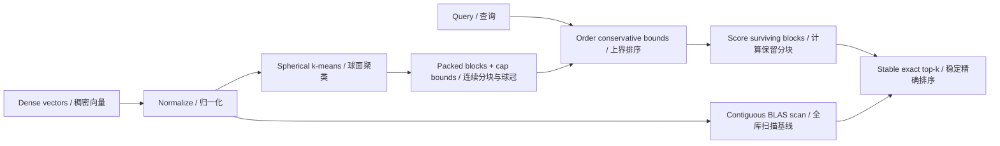
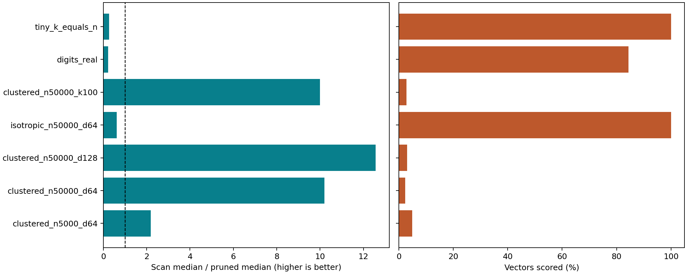

# CapPrune

**通过可审阅的球冠分块剪枝实现精确余弦向量检索。**

[English](README.md) · [GitHub](https://github.com/hardwork-xu/capprune) · [CI 运行](https://github.com/hardwork-xu/capprune/actions)

[](https://github.com/hardwork-xu/capprune/actions/workflows/ci.yml)


## 为什么做这个项目

我选择研究一个具体的检索瓶颈：只需要少量相似结果时，仍然反复为全库向量评分。我希望让这项优化的取舍可以检查，包括几何剪枝输给高效稠密计算的场景。目标使用者是研究精确向量检索的工程师、维护本地不可变向量集合的人，以及需要近似检索正确性参考的研究者。

项目贡献是一套完整 CPU 实现：分块构建、保守角度上界、保持并列顺序的部分 top-k 选择、持久化验证和可复现实验。球面 k-means 与角度分支定界都是已有方法，不是本项目新发明的算法。NumPy 提供矩阵运算，本仓库实现搜索控制逻辑与不变量。详见[一手资料比较](docs/zh/RESEARCH.md)。

## 范围与状态

已在 macOS 26.6.2 arm64、Apple M1 Pro、16 GiB、Python 3.12.2、NumPy 2.2.6 / Accelerate 上验证三条搜索路径（`scan`、`blocked`、`pruned`）、API、双语 CLI、离线演示、原子保存与重载、70 项测试及包安装。[Ubuntu 24.04 的 GitHub Actions](https://github.com/hardwork-xu/capprune/actions/runs/35602650743) 也通过了相同的 70 项测试、静态/类型检查、包构建、基准冒烟测试、图表生成及 Docker 构建和运行。声明支持的 Python 范围为 3.12。完整性能测量仍仅来自 macOS，CI 冒烟测试不是 Linux 性能结论。详见[公开发布证据](results/publication.json)。不提供 GPU 后端、在线更新、稀疏向量、嵌入模型或服务层。

算法在实数算术下精确；float64 实现通过保守余量保护，并与扫描基线核对。这不是针对所有对抗性输入及 BLAS 实现的形式化区间算术认证。计算分数相同时，按原始行 ID 升序排列。

## 架构与机制



对归一化查询 `q`、单位分块中心 `c`，令 `a=q·c`、保守球冠最小值 `s≤min(x·c)`：当 `a≥s` 时，上界 `U=1`；否则 `U=a*s+sqrt(1-a²)*sqrt(1-s²)`。按照上界降序访问分块，仅当保守上界严格低于当前第 k 大分数时剪枝。所有返回项都经过实际评分。[证明与数值约定](docs/zh/RESEARCH.md)解释了向外舍入与局限。

索引有意同时保留原始顺序和连续分块的 float64 数组，仅向量部分就占用 `16*N*d` 字节。分配阶段的评分矩阵受临时内存预算约束，但进程总内存没有硬上限。最坏情况仍然扫描全部向量。`blocked` 保留相同布局并关闭剪枝，用于隔离核心机制的贡献。

## 安装与快速开始

克隆公开仓库后，在仓库根目录使用 Python 3.12 执行。引导环境和项目环境均为本地隔离环境，不需要全局安装包。首次需要下载依赖，此后默认测试与演示可以离线运行。

```sh
git clone https://github.com/hardwork-xu/capprune.git
cd capprune
python3.12 -m venv .bootstrap
.bootstrap/bin/python -m pip install uv==0.8.22
.bootstrap/bin/uv sync --frozen
make demo
make check
make build
```

若已有 `uv==0.8.22`，可用 `uv sync --frozen` 替代三条引导环境命令。[锁文件](uv.lock)固定完整依赖版本和哈希。`make build` 在 `dist/` 生成 wheel 和源码分发包。

```python
import numpy as np
from capprune import CapIndex

vectors = np.array([[1., 0.], [0., 1.], [1., 1.]])
index = CapIndex.build(vectors, n_clusters=2)
result = index.search([1., 0.], k=2)
assert result.ids.tolist() == [[0, 2]]
index.save("index.npz")
assert CapIndex.load("index.npz").search([1., 0.], k=2).ids.tolist() == [[0, 2]]
```

CLI 接受自己的有限、非零、稠密 `.npy` 数组，每行一个向量。以下文件操作命令需要已存在的 `vectors.npy` 和 `queries.npy`；第一条命令是独立合成演示，不需要文件或模型下载。

```sh
.venv/bin/python examples/demo.py
.venv/bin/capprune build vectors.npy index.npz --clusters 64
.venv/bin/capprune query index.npz queries.npy --k 10 --mode pruned --output matches.json
.venv/bin/python benchmark.py --output results/my-run.json
.venv/bin/python scripts/analyze.py results/my-run.json --output-dir results/my-analysis
.venv/bin/python scripts/validate_results.py results/reference.json
```

允许空查询批次；拒绝空索引、零向量、非有限值、维度不符、非法预算及不在 `[1,N]` 内的 k。加载索引禁用 pickle 并重新计算上界元数据。只加载大小可信的文件，解压内存没有沙箱限制。完整接口与错误行为见[架构文档](docs/zh/ARCHITECTURE.md)。

## 目标与实测结果

目标在性能测量前提交到 [protocol.json](configs/protocol.json)。正式运行每个场景使用 40 条查询、7 次重复、4 条预热查询、随机模式/查询顺序，在线批大小为 1。各模式使用相同 float64 输入和 CPU 后端。设置 `VECLIB_MAXIMUM_THREADS=1`、`OPENBLAS_NUM_THREADS=1` 和 `OMP_NUM_THREADS=1` 请求线程预算为 1；threadpoolctl 无法直接内省 Accelerate 的实际线程数。

| Target / 目标 | Measured / 实测 | Status / 状态 |
|---|---|---|
| Primary ≥1.50×, clustered_n50000_d64 | 10.20× | met / 达到 |
| Mean scored ≤30% | 2.3% | met / 达到 |
| Ordered IDs identical; score atol=rtol=1e-12 | 5,880 / 5,880 passed | met / 达到 |

| Case / 场景 | Scan ms | Blocked ms | Pruned ms | Speedup / 加速比 | Scored / 评分比例 | Build ms |
|---|---:|---:|---:|---:|---:|---:|
| clustered_n5000_d64 | 0.1015 | 0.3225 | 0.0464 | 2.19× | 4.9% | 16.2 |
| clustered_n50000_d64 | 0.9159 | 1.6033 | 0.0898 | 10.20× | 2.3% | 177.2 |
| clustered_n50000_d128 | 1.4321 | 2.0885 | 0.1140 | 12.56× | 3.1% | 311.5 |
| isotropic_n50000_d64 | 1.0157 | 1.6096 | 1.6252 | 0.62× | 100.0% | 168.6 |
| clustered_n50000_k100 | 0.9809 | 1.8960 | 0.0981 | 10.00× | 2.8% | 170.6 |
| digits_real | 0.0512 | 0.2590 | 0.2251 | 0.23× | 84.4% | 6.6 |
| tiny_k_equals_n | 0.0170 | 0.0512 | 0.0629 | 0.27× | 100.0% | 0.6 |

主场景 10.20 倍收益来自**有利的合成聚类数据**，不是生产嵌入数据。真实手写数字场景比扫描约慢 4.4 倍；各向同性随机数据和极小 k=N 输入也更慢。紧致球冠可以减少评分；较松的球冠则留下额外调度与候选合并成本。本项目不宣称普遍加速、优于近似检索、加速模型推理或提高相关性。



表格和图由 [analyze.py](scripts/analyze.py) 根据[全部原始样本](results/reference.json)自动生成。[汇总 JSON](results/analysis/summary.json)包含四分位数、每轮中位数、吞吐、索引数组占用及保守构建摊销估计。查询计时包含校验、归一化、上界、评分、选择及结果分配；构建、保存和加载单独记录。这不是应用端到端测量。RSS 是进程累计口径，不能当作某个算法的独立内存占用。详见[完整协议及退化结果](docs/zh/EXPERIMENTS.md)。

## 维护、发布与引用

我希望长期把项目集中在可理解的检索机制和可复现证据上。后续修改应保留已冻结结果，并说明工作负载或假设的变化。[AGENTS.md](AGENTS.md)记录仓库约定，[贡献指南](CONTRIBUTING_zh.md)和[安全说明](SECURITY_zh.md)覆盖维护方式及输入限制。

代码采用 [MIT 许可证](LICENSE)。第三方依赖与真实手写数字数据集保留各自许可证及归属，见 [NOTICE_zh.md](NOTICE_zh.md)。引用时使用“CapPrune: auditable exact cosine search, version 0.1.0”并附使用的源码 revision。公开源码仓库为 [hardwork-xu/capprune](https://github.com/hardwork-xu/capprune)。本项目没有宣称已分配 DOI、发布到软件包平台、创建托管 GitHub release 或部署公网服务。由于尚未确认完整的公开作者元数据，未生成 `CITATION.cff`。

公开历史从经过脱敏的源码快照开始。[开发记录](docs/zh/DEVELOPMENT.md)及实验记录中的原始本地提交 ID 作为来源证据保留，不是此公开远端上可访问的提交。原始证据中的逐文件 SHA-256 可用于核验数值核心与冻结协议和实测源码一致。公开仓库排除私人本地 Git 身份元数据。

## 文档导航

- [研究、来源与证明](docs/zh/RESEARCH.md)
- [架构与 API](docs/zh/ARCHITECTURE.md)
- [实验及负面结果](docs/zh/EXPERIMENTS.md)
- [实际开发记录](docs/zh/DEVELOPMENT.md)
- [代码导读](docs/zh/WALKTHROUGH.md)
- [发布准备与引用](docs/zh/RELEASE.md)
- [简历证据与项目讲解](docs/zh/RESUME.md)

验证证据：[机器可读验收](results/acceptance/checks.json)、[公开文件审计](results/acceptance/audit.json)、[环境记录](results/environment.json)。
