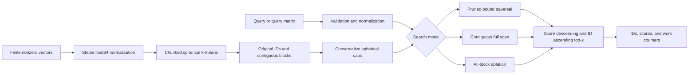

# Architecture and API

[简体中文](../zh/ARCHITECTURE.md) · [Home](../../README.md) · [Walkthrough](WALKTHROUGH.md)

## Scope and data flow

CapPrune is an in-process, immutable, dense CPU index for exact cosine top-k. Its performance experiment concerns single-query float64 CPU search; accepting a matrix of queries does not turn the implementation into a batched GEMM engine. NumPy provides array storage and dense numerical kernels. CapPrune implements normalization, clustering, packed storage, certificates, traversal, deterministic top-k, validation, and persistence.



The CLI handles `.npy` input, configuration, JSON output, and expected user errors. The index has no HTTP service, database, worker pool, background tasks, or model download. A caller can keep one index and issue repeated searches without retaining query history.

## Module responsibilities

| Module | Responsibility |
|---|---|
| `src/capprune/index.py` | Core array validation, index construction, search modes, result contract, and NPZ persistence. |
| `src/capprune/__init__.py` | Public `CapIndex` and `SearchResult` exports. |
| `src/capprune/cli.py` | Bilingual command help, offline demo, build/query commands, and JSON serialization. |
| `src/capprune/__main__.py` | `python -m capprune` entry point. |
| `examples/demo.py` | Installed-package demonstration using the same CLI code path. |
| `benchmark.py` | Frozen workloads, measurement, correctness checks, and raw experiment records. |
| `scripts/analyze.py` | Tables and figures derived from the recorded measurements. |
| `scripts/evidence.py` | Environment and source provenance support. |
| `tests/` | Actual numerical, persistence, CLI, and benchmark execution checks. |

## Public Python API

```python
import numpy as np
from capprune import CapIndex

vectors = np.array([[1.0, 0.0], [0.0, 1.0], [-1.0, 0.0]])
index = CapIndex.build(vectors, n_clusters=3, seed=0)
result = index.search([1.0, 0.0], k=2, mode="pruned")
assert result.ids.tolist() == [[0, 1]]
index.save("index.npz")
restored = CapIndex.load("index.npz")
assert restored.search([1.0, 0.0], k=2).ids.tolist() == [[0, 1]]
```

`CapIndex.build(vectors, *, n_clusters=32, iterations=8, seed=0, max_matrix_bytes=67108864)` accepts a two-dimensional real numeric array of shape `(N, d)` with `N >= 1` and `d >= 1`. Every row must be finite and nonzero. Boolean, string, object, and complex arrays are rejected. Inputs are copied and normalized; the caller's input is not modified. Counts and iterations must be positive integers; seed must be a nonnegative integer. Requested clusters are clamped to `N` and empty clusters are removed, so `index.n_clusters` reports the actual nonempty count. A byte budget too small for one assignment row is rejected.

`index.search(queries, k=10, *, mode="pruned")` accepts one vector of shape `(d,)` or a matrix `(nq, d)`. Empty batches with shape `(0, d)` are valid. Each nonempty query row must satisfy the same finite/nonzero rules. `k` must be an integer in `[1, N]`; booleans are rejected. Valid modes are `pruned`, `scan`, and `blocked`. Invalid configuration or numerical input raises `ValueError` with English and Chinese context.

| Result field | Shape | Meaning |
|---|---|---|
| `ids` | `(nq, k)` | Original zero-based row IDs, ordered by score descending and original ID ascending for equal computed scores. |
| `scores` | `(nq, k)` | Actual float64 cosine scores. |
| `evaluated_vectors` | `(nq,)` | Number of database vectors whose query dot product was computed. |
| `visited_blocks` | `(nq,)` | Number of visited blocks; scan reports the full index block count. |
| `bound_evaluations` | `(nq,)` | Number of spherical-cap query bounds; zero for scan and blocked modes. |

`SearchResult` is a frozen dataclass and its arrays are read-only. `index.vectors` exposes a read-only view in original order. `index.metadata` returns an independent dictionary describing schema, package version, shape, dtype, numerical margin, and build configuration. `size`, `dimension`, and `n_clusters` are integers. `memory_bytes` counts arrays owned by the index, excluding Python objects, query temporaries, allocator effects, and BLAS workspace; it is **not process RSS**. Deliberately reaching into private attributes or changing array flags is outside the public API's immutability contract.

`save(path)` writes a non-pickle NPZ index; `CapIndex.load(path)` validates its schema, vectors, labels, and build options, then reconstructs packed blocks and cap bounds from actual members. Saved centers or bounds are never trusted. Expected malformed input raises `ValueError`; filesystem failures raise `OSError`. No decompression quota is enforced: only load local archives whose size is trusted. This is a persistence format, not a secure remote-upload interface.

## Search paths and invariants

`scan` performs one contiguous BLAS matrix-vector product and one top-k selection per query. It is a practical exhaustive baseline. `blocked` visits every packed block in storage order and merges candidates after each block; it disables bounds and pruning. `pruned` computes one bound per block, visits blocks in decreasing bound order, and stops only when a block's conservative bound is strictly lower than the current kth score. At least `k` actual candidates must exist before pruning.

All modes normalize queries, compute actual scores, and use the same top-k routine. They preserve original IDs despite packing. The top-k routine retains every candidate equal to the partition cutoff before applying score/ID ordering. Exact-score ties therefore cannot be lost by an arbitrary partition boundary. Bound equality also cannot justify skipping a block, because that block may contain a smaller original ID.

The immutable partition, stable original IDs, cap enclosure, and strictly conservative stopping condition are the key invariants. The real-arithmetic geometric argument and float64 limitations are in [RESEARCH.md](RESEARCH.md). A malformed partition or cap can corrupt correctness even if the returned scores look plausible; persistence reconstruction and numerical tests protect this boundary.

## Resources and tradeoffs

Build assignment matrices are chunked by `max_matrix_bytes`. This budget does not cap the entire process. The index intentionally retains original vectors for the contiguous baseline and a packed copy for block traversal: these two arrays alone occupy `16*N*d` bytes. Labels, order, offsets, centers, and cap minima add storage. Deleting the last index/result reference lets Python and NumPy release their allocations; the operating system need not immediately reduce reported RSS.

Each search owns its scratch arrays; queries do not mutate the index or a global cache. Matrix inputs are processed one query at a time. The benchmark sets the BLAS thread budget explicitly; the library does not change global thread settings. Callers coordinating concurrent requests must budget CPU threads and memory themselves. Performance results do not establish concurrent throughput or multi-tenant isolation.

Flat blocks keep the mechanism inspectable and provide contiguous local computation, at the cost of Python dispatch and repeated candidate merging. A hierarchy might prune more but adds construction and traversal complexity. An approximate index could offer a different speed/recall tradeoff, but would change the contract. A production retrieval system may prefer float32, GPU kernels, automatic scan fallback, or incremental updates; none is implemented or claimed here.

## CLI contract

```sh
.venv/bin/python -m capprune demo
.venv/bin/python -m capprune build vectors.npy index.npz --clusters 32 --seed 0
.venv/bin/python -m capprune query index.npz queries.npy --k 10 --mode pruned
.venv/bin/python -m capprune query index.npz queries.npy --k 10 --output results.json
```

Help text and project-authored errors contain English and Chinese. Machine-readable fields remain English. `demo` labels its data as synthetic and compares actual scan/pruned results; it does not claim model-level quality or measured speedup. A successful operation returns `0`; a demo correctness mismatch returns `1`; ordinary argument, input, or filesystem errors return `2` without a traceback. File output requires an existing parent directory and uses temporary-file replacement so partial JSON is not published. Input and output paths cannot be the same. The default demo requires neither network access nor pretrained weights.
