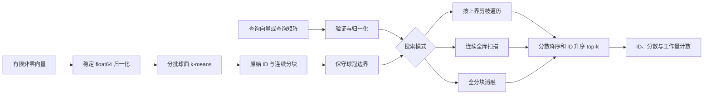

# 架构与 API

[English](../en/ARCHITECTURE.md) · [主页](../../README_zh.md) · [代码导读](WALKTHROUGH.md)

## 范围与数据流

CapPrune 是进程内、不可变、面向稠密 CPU 向量的精确余弦 top-k 索引。性能实验针对 float64 单查询 CPU 搜索；接受查询矩阵并不意味着实现了批量 GEMM 引擎。NumPy 提供数组存储和稠密数值内核。CapPrune 实现归一化、聚类、连续分块、证书、遍历、确定性 top-k、验证与持久化。



CLI 负责 `.npy` 输入、配置、JSON 输出及预期用户错误。索引不包含 HTTP 服务、数据库、工作线程池、后台任务或模型下载。调用者可以保留一个索引反复查询，而不保留查询历史。

## 模块职责

| 模块 | 职责 |
|---|---|
| `src/capprune/index.py` | 核心数组验证、建库、搜索模式、结果约定与 NPZ 持久化。 |
| `src/capprune/__init__.py` | 导出公共 `CapIndex` 与 `SearchResult`。 |
| `src/capprune/cli.py` | 双语帮助、离线演示、建库/查询命令和 JSON 序列化。 |
| `src/capprune/__main__.py` | `python -m capprune` 入口。 |
| `examples/demo.py` | 安装包后运行的示例，使用同一 CLI 路径。 |
| `benchmark.py` | 冻结工作负载、测量、正确性检查和原始实验记录。 |
| `scripts/analyze.py` | 根据已记录测量生成表格和图。 |
| `scripts/evidence.py` | 环境和源码来源记录支持。 |
| `tests/` | 实际数值、持久化、CLI 与基准执行检查。 |

## 公共 Python API

```python
import numpy as np
from capprune import CapIndex

vectors = np.array([[1.0, 0.0], [0.0, 1.0], [-1.0, 0.0]])
index = CapIndex.build(vectors, n_clusters=3, seed=0)
result = index.search([1.0, 0.0], k=2, mode="pruned")
assert result.ids.tolist() == [[0, 1]]
index.save("index.npz")
restored = CapIndex.load("index.npz")
assert restored.search([1.0, 0.0], k=2).ids.tolist() == [[0, 1]]
```

`CapIndex.build(vectors, *, n_clusters=32, iterations=8, seed=0, max_matrix_bytes=67108864)` 接受形状 `(N, d)` 的二维实数数组，要求 `N >= 1` 且 `d >= 1`。每行须有限且非零。拒绝布尔、字符串、对象和复数数组。输入会被复制并归一化，不修改调用者的数组。数量与迭代次数须为正整数，种子须为非负整数。请求的簇数截断至 `N`，空簇被移除，因此 `index.n_clusters` 返回实际非空簇数。若字节预算无法容纳一行分配分数矩阵，则拒绝建库。

`index.search(queries, k=10, *, mode="pruned")` 接受形状 `(d,)` 的单向量或 `(nq, d)` 的矩阵。允许形状 `(0, d)` 的空批次。每个非空查询行须满足同样的有限、非零约束。`k` 须为 `[1, N]` 内整数，拒绝布尔值。有效模式为 `pruned`、`scan` 和 `blocked`。非法配置或数值输入抛出带英文与中文上下文的 `ValueError`。

| 结果字段 | 形状 | 含义 |
|---|---|---|
| `ids` | `(nq, k)` | 从零开始的原始行 ID；按分数降序、计算所得分数相等时原始 ID 升序排列。 |
| `scores` | `(nq, k)` | 实际 float64 余弦分数。 |
| `evaluated_vectors` | `(nq,)` | 实际计算了与查询点积的库内向量数。 |
| `visited_blocks` | `(nq,)` | 访问的分块数；scan 报告索引的完整分块数。 |
| `bound_evaluations` | `(nq,)` | 查询球冠上界计算数；scan 与 blocked 为零。 |

`SearchResult` 是冻结的数据类，其数组只读。`index.vectors` 提供原始顺序的只读视图。`index.metadata` 返回独立字典，包含格式版本、包版本、形状、数据类型、数值余量与建库配置。`size`、`dimension` 和 `n_clusters` 均为整数。`memory_bytes` 统计索引自有数组，不含 Python 对象、查询临时数组、分配器影响和 BLAS 工作区；它**不是进程 RSS**。刻意访问私有属性或改变数组标志的操作不属于公共 API 的不可变性约定。

`save(path)` 写入不含 pickle 的 NPZ 索引；`CapIndex.load(path)` 验证格式、向量、标签和建库参数，再从实际成员重建连续分块与球冠上界。不会信任外部保存的中心或上界。预期的格式错误抛出 `ValueError`，文件系统错误抛出 `OSError`。没有解压配额：仅加载大小可信的本地文件。这是持久化格式，不是安全的远程上传接口。

## 搜索路径与不变量

`scan` 对每条查询执行一次连续 BLAS 矩阵向量乘和一次 top-k 选择，是实用的穷举基线。`blocked` 按存储顺序遍历所有连续分块，每块之后合并候选，不计算上界也不剪枝。`pruned` 为每块计算上界，按上界降序遍历，仅当某块保守上界严格小于当前第 k 个分数时停止。剪枝前必须已收集至少 `k` 个实际候选。

全部模式均归一化查询、计算实际分数，并使用同一 top-k 函数。分块重排后仍保留原始 ID。top-k 函数先保留与分区边界分数相等的全部候选，再按分数/ID 排序。因此，任意分区边界不会丢掉精确并列项。上界相等也不足以剪枝，因为该块可能存在原始 ID 更小的向量。

不可变分区、稳定原始 ID、球冠包含关系和严格保守的停止条件是关键不变量。实数算术证明和 float64 局限见 [RESEARCH.md](RESEARCH.md)。即使返回分数看似正常，错误的分区或球冠也可能破坏正确性；持久化重建与数值测试保护这一边界。

## 资源与取舍

建库分配矩阵按 `max_matrix_bytes` 分批。该预算不限制整个进程。索引有意保留用于连续基线的原始向量和用于块遍历的重排副本，仅这两个数组就占 `16*N*d` 字节。标签、重排顺序、偏移、中心和球冠下界额外占内存。删除索引/结果的最后一个引用后，Python 与 NumPy 可以释放对应分配，但操作系统报告的 RSS 不一定立即下降。

每次查询都有独立临时数组，不修改索引或全局缓存。矩阵输入逐条处理。基准显式固定 BLAS 线程预算，库本身不改变全局线程设置。协调并发请求的调用者须自行管理 CPU 线程和内存预算。性能结果不代表并发吞吐或多租户隔离能力。

扁平分块使机制容易审阅，并提供连续的局部计算，代价是 Python 调度和反复候选合并。层次结构可能加强剪枝，但会增加建库和遍历复杂度。近似索引提供另一种速度/召回率取舍，但会改变功能约定。生产检索系统可能更适合 float32、GPU 内核、自动回退扫描或增量更新；本版本均未实现，也不声称支持。

## CLI 约定

```sh
.venv/bin/python -m capprune demo
.venv/bin/python -m capprune build vectors.npy index.npz --clusters 32 --seed 0
.venv/bin/python -m capprune query index.npz queries.npy --k 10 --mode pruned
.venv/bin/python -m capprune query index.npz queries.npy --k 10 --output results.json
```

帮助文本和项目自行编写的错误同时包含英文与中文。机器可读字段保持英文。`demo` 明确标记合成数据，并比较真实 scan/pruned 结果，不宣称模型质量或实测加速。成功返回 `0`；演示正确性不一致返回 `1`；普通参数、输入或文件系统错误返回 `2`，不输出调用栈。输出文件的父目录须已存在，JSON 通过临时文件替换写入，避免发布不完整内容。输入与输出路径不得相同。默认演示无需网络或预训练权重。
